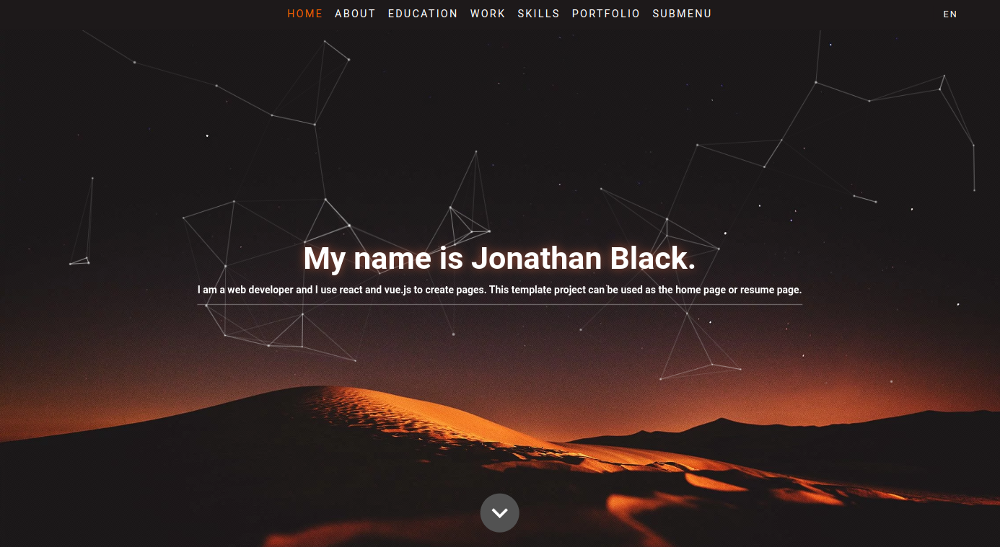

# Vue 3 modern resume
Vue 3 nuxt 3 modern resume template. A classic design with modern approach.

[](https://fos7er.github.io/vue-modern-resume/)

- [Demo](https://fos7er.github.io/vue-modern-resume/)

## Features

- [X] [Nuxt 3](https://nuxt.com/)
- [X] [State & Store Management (Pinia)](https://pinia.vuejs.org/)
- [X] [Nuxt i18n](https://i18n.nuxtjs.org/)
- [X] [Tailwind CSS v3](https://tailwindcss.com/)
- [X] [@egoist/tailwindcss-icons](https://github.com/egoist/tailwindcss-icons/)
- [X] [Lightgallery](https://www.lightgalleryjs.com/)
- [X] [GSAP animations](https://gsap.com/)
- [X] [tsparticles](https://particles.js.org/)
- [X] [Sitemap](https://nuxtseo.com/sitemap/getting-started/installation)
- [X] Ready to deploy to github pages


## Getting Started

### Installation

- clone this repository
  ```bash
  git clone https://github.com/fos7er/vue-modern-resume
  ```
- install dependencies
  ```bash
  npm install
  ```
- run development server
  ```bash
  npm run dev
  ```
#### Production

- run build
  ```bash
  npm run generate
  ```
